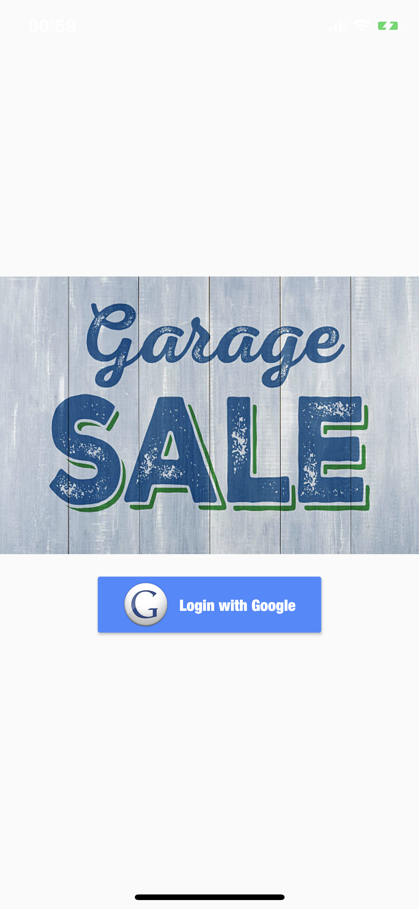

# garage_sale

A new Flutter application.

## Getting Started

This project is a starting point for a Flutter application.

A few resources to get you started if this is your first Flutter project:

- [Lab: Write your first Flutter app](https://flutter.io/docs/get-started/codelab)
- [Cookbook: Useful Flutter samples](https://flutter.io/docs/cookbook)

For help getting started with Flutter, view our 
[online documentation](https://flutter.io/docs), which offers tutorials, 
samples, guidance on mobile development, and a full API reference.


## iOS part:

####	Install [Offical guideline](https://flutter.dev/docs/get-started/install/macos#deploy-to-ios-devices)

* Install Flutter SDK

* Deploy to iOS devices

	We use Xcode to connect MacOS and iPhone. It is necessary to sign in with a personal team and sign certificate as an iPhone developer as well.

* Firebase Configuration

	We want to use firebase to save item data, and the database should match with the bundle identifier in Runner file. Meanwhile, we update the GoogleService-Info.plist document to connect firebase with our app.

#### Run

* Run Xcode in order to connect iPhone to the computer

	```
	open ios/Runner.xcworkspace/
	
	```
	to run Xcode build.
	
* Run project

	```
	Flutter run
	
	```

#### Demo

* Welcome page

	

	When we run our project successfully, there is a welcome page to log in using your email address.
	
* Login page

	
	
	You may sign in using your google account. When you have logged into your account, you could sign in at any time.
	
* Home page

	
	
	Success to log in! We have uploaded two test items and saved information in firebase, so that you can see them in the item part.

	There are four categories named phone, garment, car and digitals at the top.
	
	At the bottom, you could choose “Home” to see different categories, use “Products” to watch item details in a line and touch “Profile” to edit your personal profile.

* Products page details

	
	
	When you click a specific item, you could see more details about this item such like price, description, seller and whether it is available.
	
* Post a new item

	
	
	Enter the necessary messages, add photos and post it! You could also take a photo of you items.
	
* Post it!!!

	
	
	Haha, you have been post it on our app! Congratulations!
	
* Update profile

	
	
	You can update your phone number and profile photo by clicking the Profile tag.


	
